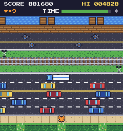

# VastGameKit

A small 2D game engine for the browser, written in TypeScript and drawn on a canvas. It's built for simple games that
can be embedded in a web page, especially pixel-art ones: the game steps at a fixed rate, the canvas scales up by whole
pixels to fit the page, and a game is put together from:

- **Scenes and cameras**: levels, menus, and HUDs as Scenes, with cameras that follow, pan, and split the screen, and
  sub-scenes floating above or embedded in a Scene
- **Actors**: sprites with animation, flips, scaling, rotation, and fading; motion with sub-pixel speeds; collision
  between rectangles and circles, with solids to stop against
- **Input**: keyboard, mouse, touch, and pen, with swipes and dragging, and on-screen buttons and a d-pad for phones
- **Audio**: sound effects and music, unlocked on the player's first click, tap, or key press
- **Text**: bitmap fonts for crisp pixel text, or any CSS font
- **Timers, events, and saved values**: everything counted in game steps, messages between parts of a game, and high
  scores and settings kept in the browser
- **[Tiled](https://www.mapeditor.org/) maps**: paint a level in Tiled, and load its tiles, walls, and objects into a Scene

There are no dependencies: the engine is plain TypeScript using the browser's canvas, Web Audio, and Pointer Events.

## The demo: Nine Lives



The game in `game/` is **Nine Lives**, a lane-crossing arcade game in the spirit of Frogger: a cat hops across roads,
a railroad, and a canal to the boxes on a rooftop, with nine lives to do it. Each round the traffic gets faster.

**[Play it in your browser](https://seannormoyle.net/games/nine-lives/play/)**: hop with the arrow keys or WASD,
press P to pause and M for sound, or on a phone, steer with an on-screen d-pad.

Nine Lives uses most of the engine, so it's also its working example and its test bed: the level and title screen are
Tiled maps, a camera follows the cat up the level under a floating HUD, the cat rides crates and ducks across the
canal, and high scores and settings are saved. Every image and sound in it is generated from text by scripts in
`tools/`, so the whole game is source code.

To run it:

```sh
npm install
npm run debug    # then open http://localhost:9000
```

## Documentation

- **[Making a game](docs/making-a-game.md)**: setting up a game's own project, how the engine's pieces fit together,
  and a guide to each feature
- **[A minimal game](docs/a-minimal-game.md)**: a small but complete game, *Coin Dash*, explained line by line
- **[Developing the engine](docs/developing.md)**: working on VastGameKit itself: building, testing, the demo's tools,
  and releasing

## Repository

| Folder | What's in it |
| --- | --- |
| `engine/` | the engine, exported from `engine/index.ts` |
| `game/` | Nine Lives |
| `tools/` | the scripts that draw Nine Lives' images and synthesize its sounds |
| `test/` | the engine's tests |
| `docs/` | these guides |

## License

[MIT](LICENSE)
